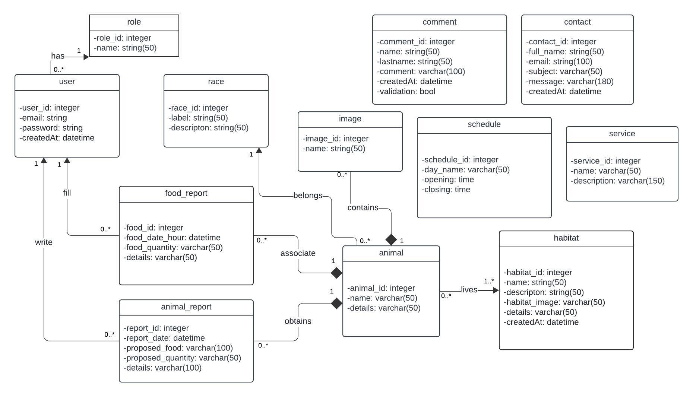
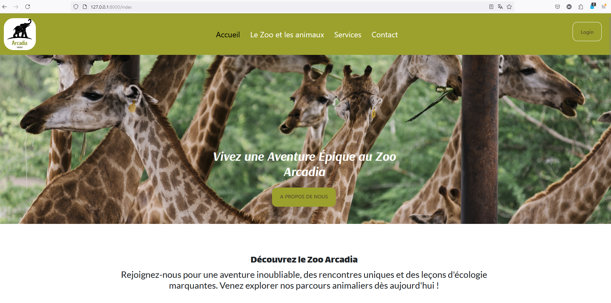
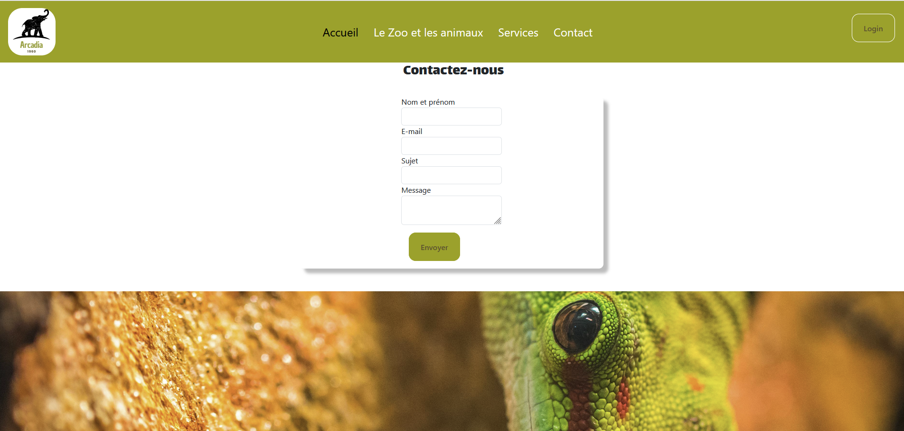

# Arcadia Zoo Web Application

This guide will help you set up and explore the Arcadia Zoo web application :)

## Project Description
The Arcadia Zoo web application makes it easier for visitors to explore and enjoy everything the zoo has to offer. It provides detailed information about the animals, their health, the available services, and the zoo's opening hours.

Created by DevSoft, this app is designed to attract more visitors and improve the zoo's reputation with a simple and enjoyable online experience.

## Client Background
Established in 1960, Arcadia Zoo is located near the Brocéliande Forest in Brittany, France. The zoo has a diverse range of animals across unique habitats, including the savannah, jungle, and marshlands, with their care as a top priority. A dedicated team of veterinarians performs daily health checks, and each animal's diet is carefully planned according to expert guidelines. Led by the visionary José, Arcadia Zoo remains committed to its mission of conservation and education.
## Technologies Used

- **HTML**
- **CSS**
- **SASS**
- **Bootstrap**
- **JavaScript**
- **PHP 8.2.11**
- **Symfony CLI version 7.1**
- **MySQL**
- **MariaDB**
- **MongoDB**
- **Docker**
- **Visual Studio Code** as IDE
- **Visual Studio Code Extension Database Client v1.3.5**
- **MailTrap** for testing email-sending functionalities

## Main Page Structure

### Homepage

- **Introduction to Arcadia Zoo**: Overview of the zoo and its key attractions.
- **Services**: Highlights of the services offered to visitors.
- **Reviews**: Visitor feedback and comments.

### Services Page

- **Services Overview**: Details about the services available to visitors.
- **Opening Hours and Pricing**: Information about zoo hours and entry fees.

### Habitats Page

- **Global View of Habitats**: Explore the zoo's various habitats (savannah, jungle, forest).
- **Consultation Statistics**: Data on the popularity of each habitat.

### Animals Page

- **Animal List**: A catalog of animals in the zoo with filters for refined searches.
- **Animal Details**: In-depth information about each animal.

### Contact Page

- **Contact Us**: A contact form for visitors to leave their details and specific inquiries.

## Features

### Administrator

- **Login**: Secure access to the administrator dashboard, account validation and password modification if required for login..
- **Employee Management**: Create and manage employee accounts.
- **Animal Management**: Add, modify, or delete animals in the catalog.
- **Service Management**: Update the services offered.
- **Schedule Management**: Adjust the zoo's opening hours.
- **Review Management**: Validate to visitor comments.
- **Reception of emails**: The administrator will be also receiving the messages sent by the visitors via the application.   

### Employees

- **Login**: Secure access to the administrator dashboard, account validation and password modification if required for login.
- **Animal Management**: Add, modify, or delete animals in the catalog.
- **Service Management**: Update the services offered.
- **Review Management**: Validate visitor comments.

### Veterinarians

- **Login**: Secure access to the administrator dashboard, account validation and password modification if required for login.
- **Health Checks**: Manage animal health reports.

### Visitors

- **Animal Exploration**: Browse the animal catalog by race and habitat, the animal page will also display the animal health reports.
- **Service Consultation**: Discover the services offered by the zoo.
- **Contact Form**: Submit inquiries and questions via a contact form.
- **Reviews**: Leave comments and read feedback from other visitors.

## Requirements

### Required Installations

- **PHP v.8.2**
- **Composer**
- **Symfony v.7**
- **NPM**
- **Docker**

## Running the Application with Docker

### Prerequisites

- Ensure **Docker** is installed on your machine. Download Docker [here](https://docs.docker.com/get-docker/).

### Steps to Run the Project with Docker

1. **Pull the Docker image for the project from Docker Hub:**

    ```sh
    docker pull maryeln/zoo-arcadia
    ```

2. **Run the Docker container to launch the application:**

    ```sh
    docker run -d -p 8080:80 maryeln/zoo-arcadia
    ```

3. **Access the application in your browser at** `http://localhost:8080`.

## Running Locally

Follow these steps to set up and run the project locally:

1. Clone the repository:

    ```bash
    git clone https://github.com/MaryelN/Zoo-Arcadia.git
    ```

2. Install PHP and Node.js dependencies:

    ```bash
    composer install
    npm install
    npm run build
    ```

3. Configure your database in the `.env.local` file.
4. Run database migrations:

    ```bash
    php bin/console doctrine:migrations:migrate
    ```

5. Start the Symfony server:

    ```bash
    symfony server:start
    ```

6. Start the SCSS and JavaScript compiler in watch mode:

    ```bash
    npm run watch
    ```
7.Test connexion
    As administrator:
        Username: arcadia@zoo.com   Password: admin.zoo2024
    As veterinary :
        Username: vboucher@hotmail.fr  Password:password
    ## Design and Wireframes

The application's wireframes were created using Figma. You can view the interface design [[here](https://www.figma.com/design/qCIGY1QXWcKILNDJCiKqDM/Zoo-Arcadia?node-id=202-1622&t=xeGi8sbDk8HBIZk2-1)].

## UML Database Diagram

Below is the UML diagram of the database structure:

<div style="display: flex; flex-wrap: wrap; gap: 20px;">
    
</div>

## Screenshots

<div style="display: flex; flex-wrap: wrap; gap: 20px;">
    
    
    
</div>
