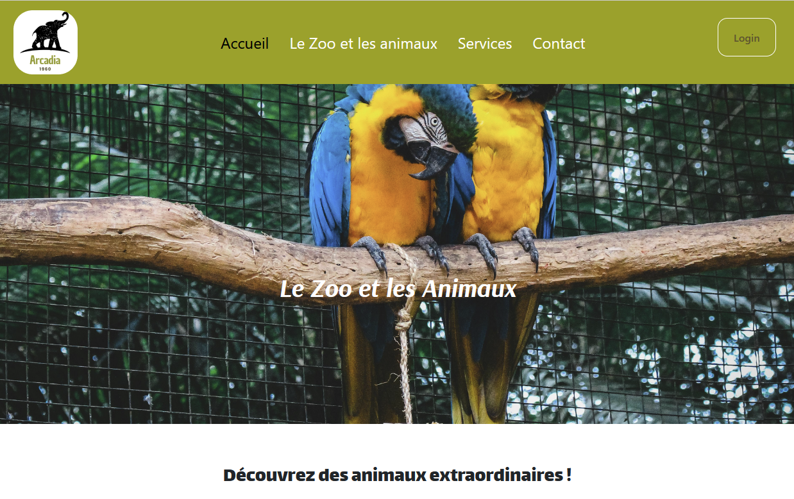

# Arcadia Zoo Application web

## Description du projet
Application web pour le Zoo Arcadia, cette application web améliore l'engagement des visiteurs en offrant une plateforme interactive pour explorer les différentes offres du zoo. 
L'application permet aux visiteurs de découvrir des informations détaillées sur les animaux du zoo, leur état de santé, les services disponibles, ainsi que les horaires d'ouverture. 

Réalisée par DevSoft, cette solution vise à accroître la visibilité du zoo et à renforcer son image de marque grâce à une expérience numérique conviviale.

## Contexte du Client
Fondé en 1960, le Zoo Arcadia est situé près de la forêt de Brocéliande en Bretagne, France. Le zoo abrite une grande variété d'animaux répartis dans différents habitats (savane, jungle, marais) et veille avec soin au bien-être de chacun. Une équipe de vétérinaires réalise chaque jour des contrôles de santé et la nourriture est soigneusement mesurée selon des rapports vétérinaires spécifiques. Sous la direction ambitieuse de José, le zoo poursuit sa mission de conservation et d'éducation.

## Technologies utilisées

- **HTML**
- **CSS**
- **SASS**
- **Bootstrap**
- **JavaScript**
- **PHP 8.2.11**
- **Symfony CLI version 7.1**
- **MySQL**
- **MariaDB**
- **MongoDB**
- **Docker**
- **Visual Studio Code** comme IDE
- **Visual Studio Code Extension Database Client v1.3.5**
- **MailTrap** pour le test des fonctionnalités d'envoi de courriels

## Structure des Pages Principales

### Page d'accueil

- **Introduction au zoo Arcadia**: Présentation du zoo et de ses principaux attraits.
- **Services**: Aperçu des services offerts aux visiteurs.
- **Avis**: commentaires de visiteurs.

  
### Page Services
- **Services**: Aperçu des services offerts aux visiteurs.
- **Horaires et tarifs**: Informations sur les horaires d'ouverture et les tarifs d'entrée.

### Page des habitats

- **Vue globale des habitats**: Exploration des différents habitats du zoo (savane, jungle, forêt).
- **Statistiques sur la consultation**: Données sur la popularité de chaque habitat.

### Page des animaux

- **Liste des animaux**: Catalogue des animaux présents dans le zoo avec des filtres pour affiner la recherche.
- **Détails des animaux**: Informations détaillées sur chaque animal.

### Page de contact

- **Contactez-nous**: Formulaire de contact pour laisser vos coordonnées et toute demande spécifique.

## Fonctionnalités

### Administrateur

- **Connexion**: Accès sécurisé à l'espace administrateur.
- **Gestion des employés**: Création et gestion des comptes d'employés.
- **Gestion des animaux**: Ajout, modification ou suppression des animaux du catalogue.
- **Gestion des services**: Mise à jour des services proposés.
- **Gestion des horaires**: Modification des heures d'ouverture du zoo.
- **Gestion des commentaires**: Réponse aux avis des visiteurs.

### Employés

- **Connexion**: Accès sécurisé à l'espace employé.
- **Gestion des animaux**: Ajout, modification ou suppression des animaux du catalogue.
- **Gestion des commentaires**: Validation des avis des visiteurs.

### Vétérinaires

- **Connexion**: Accès sécurisé à l'espace vétérinaire.
- **Contrôles de santé**: Gestion des rapports de santé des animaux.

### Visiteurs

- **Exploration des animaux**: Parcourir le catalogue des animaux avec des filtres de recherche.
- **Consultation des services**: Découvrir les services offerts par le zoo.
- **Contact**: Formulaire de contact pour toute demande de renseignements.
- **Avis**: Laisser des commentaires et lire les avis des autres visiteurs.

## Pré-requis

### Installations requises

- **PHP v.8.2**
- **Composer**
- **Symfony v.7**
- **NPM**
- **Docker**

## Exécution avec Docker

### Prérequis

- **Docker** doit être installé sur votre machine. Vous pouvez télécharger Docker [ici](https://docs.docker.com/get-docker/).

### Étapes pour Exécuter le Projet avec Docker

1. **Tirez l'image Docker du projet depuis Docker Hub :**

    ```sh
    docker pull maryeln/zoo-arcadia
    ```

2. **Lancez le conteneur Docker pour exécuter l'application :**

    ```sh
    docker run -d -p 8080:80 maryeln/zoo-arcadia
    ```

3. **Accédez à l'application dans votre navigateur à** `http://localhost:8080`.

## Exécution locale

Suivez les étapes suivantes pour configurer et exécuter le projet localement :

1. Clonez le dépôt :

```bash
git clone https://github.com/MaryelN/Zoo-Arcadia.git

```
2. Installez les dépendances PHP et  Node.js :

```bash
composer install
npm install
```
3. Configurez votre base de données dans le fichier .env.
4. Lancez les migrations de la base de données :
```bash
php bin/console doctrine:migrations:migrate
```
5.Démarrez le serveur Symfony :
```bash
symfony server:start
```
6.Démarrez le compilateur SCSS et JavaScript en mode watch :
```bash
npm run watch
```
## Conception et Maquettes

Les maquettes de l'application ont été conçues sur Figma. Vous pouvez consulter le design de l'interface utilisateur [ici]([https://www.figma.com/file/XXXXXX/zoo-arcadia?node-id=0%3A1](https://www.figma.com/design/qCIGY1QXWcKILNDJCiKqDM/Maquette-Zoo?node-id=202-1622&t=uo9RAb4tvitxR2ae-1)).

## Diagramme UML de la Base de Données

Le schéma de la structure UML de la base de données est représenté ci-dessous :


## Captures d'Écran

<div style="display: flex; flex-wrap: wrap; gap: 20px;">
    
    
    
</div>

---

Ce guide vous aide à configurer et explorer l’application web du Zoo Arcadia :)
